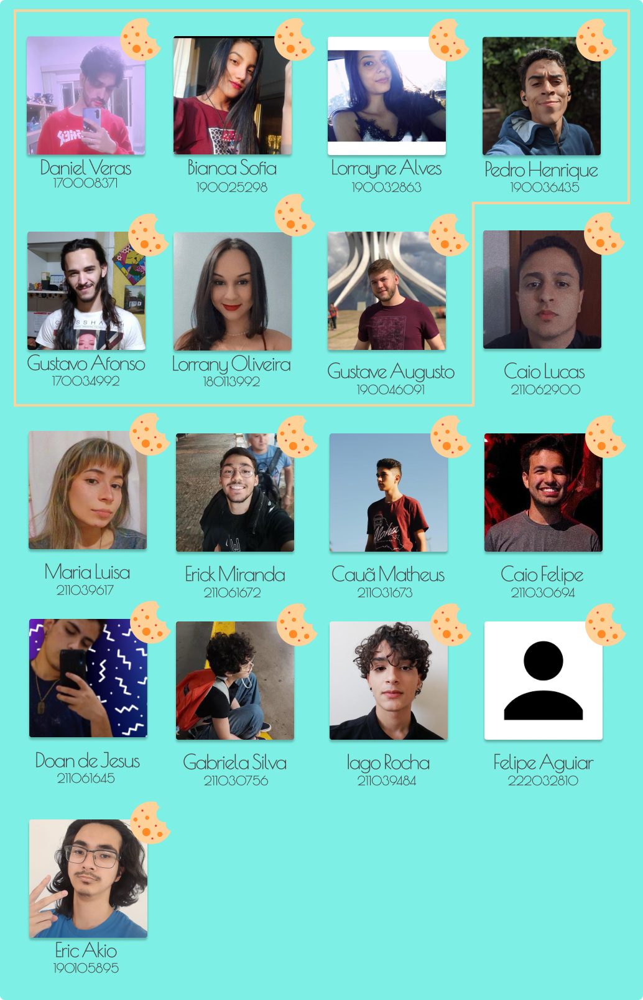

# AMIS

O projeto da Plataforma de Franquia Social surgiu no ano de 2022, sendo desenvolvido pelas disciplinas de EPS e MDS.

## Equipe

O projeto da Plataforma de Franquia Social surgiu no semestre de 2022.2, sendo desenvolvido pelas disciplinas de EPS e MDS. A Franquia Social é um projeto da ONG "Instituto Mulheres Criativas" que tem como objetivo auxiliar no desenvolvimento e capacitação de pessoas atráves de cursos, palestras e oficinas de culinária.

    

A equipe é composta por 17 membros ao todo, sendo 7 de EPS e 10 de MDS, logo acima temos os representantes do grupo, sendo os 7 primeiros da disciplina de EPS e os outros 10 de MDS.

