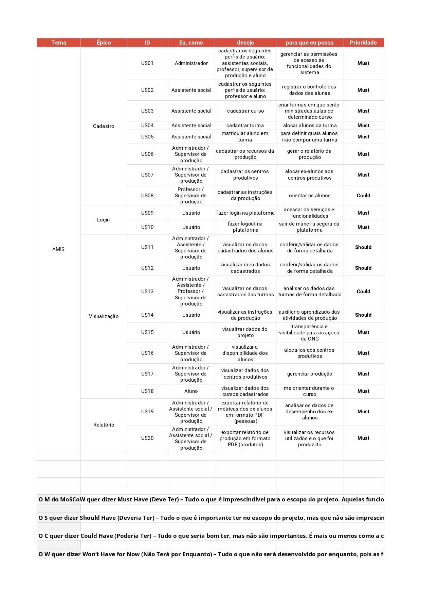

## Backlog do Produto

## 1. Introdução

 O backlog do produto é uma lista ordenada de itens de trabalho que representam as demandas e requisitos do produto. Ele serve como uma fonte centralizada de informações sobre o que precisa ser feito, com descrições claras e concisas das tarefas a serem realizadas.

A priorização do backlog é essencial para determinar a ordem em que esses itens serão abordados. Uma técnica comum de priorização é o método MoSCoW, que classifica os itens em quatro categorias: Must (Deve ter), Should (Deveria ter), Could (Poderia ter) e Won't have (Não terá).

## 2. Backlog

## Histórico de versão

|    Data    | Versão |                 Descrição                 |                Autor(es)                 |
| :--------: | -----: | :---------------------------------------: | :--------------------------------------: |
| 15/05/2023 |    1.0 | Criação de documento e adição de conteúdo | [@gpersijn](https://github.com/gpersijn) |
