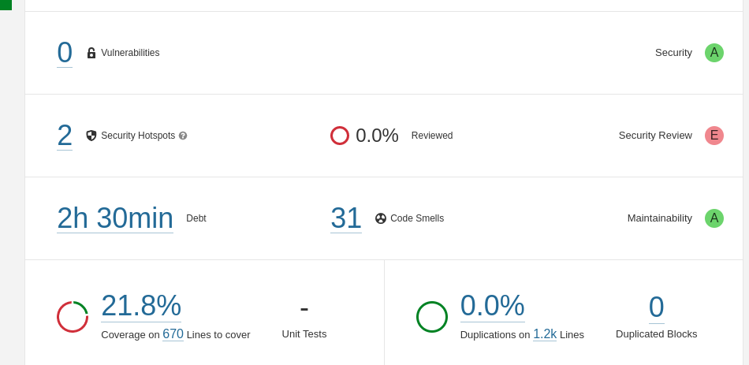

# Análise de Back-end

Esse documento tem como objetivo identificar falhas no repositório responsável pelo back-end do semestre 2022.2.

    

      

## 1. Problemas de Execução

O Readme é um documento importante, pois contém informações necessárias para o entendimento do projeto, como seus objetivos e o modo de execução de forma detalhada para facilitar o trabalho de futuros contribuidores do sistema.

No projeto atual, nos deparamos com o impasse de não conseguir executar o projeto com nenhuma das instruções dadas pelo documento, visto que as informações de execução se encontravam incompletas, tanto realizando as instalações quanto em relação ao Docker.

## 2. Arquitetura de microsserviços

O microsserviços é um tipo de arquitetura de software que visa a construção de pequenos serviços que são independentes entre si, mas que se comunicam uns com os outros utilizando APIs bem definidas. Nesse tipo de arquitetura, cada serviço realiza uma única função.

Nesse caso, o atual projeto poderia ser melhor dividido em relação a abordagem de microsserviços. Como por exemplo, atualmente a relação de cadastro de turmas, alunas, receitas, são todas realizadas em uma única API, e segundo a arquitetura de microsserviços seria melhor explorada, sendo cada uma dividida em um serviço. Isso traria uma melhor flexibilidade, escalabilidade, além de diminuir o acoplamento.

## 3. Testes

O processo de teste de software consiste em uma série de etapas para garantir que o código do programa execute sua função corretamente e não exiba um comportamento inesperado. É importante que o software seja confiável, previsível e evite surpresas desagradáveis ​​para o usuário. Os autores também definem teste como "o processo de executar um programa com a intenção de encontrar erros" (MYERS; SANDLER; BADGETT, 2011).

Nesse sentido, os testes existentes são úteis e relevantes para testar o código da API. No entanto, por problemas de configurações do projeto, a cobertura de testes unitários não é gerada. Analisando o código, é possível notar que não há cobertura de todas as linhas, também faltam testes para o serviço de login.
Segue a análise gerada pelo SonarQube.

<figure>

  <figcaption style="text-align: center !important">
    Fonte: Próprio autor
  </figcaption>
</figure>

## 4. Clean Code

Clean code é um conjunto de técnicas de programação, onde o código fonte fica fácil de ler, entender e manter. Ele é escrito de forma clara e concisa, seguindo boas práticas de programação, como utilizar nomes de variáveis descritivas, evitar duplicação de código e manter a simplicidade. O objetivo do clean code é maximizar a legibilidade do código e minimizar a probabilidade de erros. Um código limpo é mais fácil de manter e modificar, tornando-o mais eficiente e produtivo no longo prazo.

Nesse projeto existem diversas falhas quando falamos de clean code, existem várias linhas
duplicadas, código com uma sintaxe de dificil entendimento e mal estruturado. Uma possível
solução é reestruturar o cógigo pensando em boas práticas de programação.

## 5. Banco de Dados

Um banco de dados é uma ferramenta essencial para uma aplicação porque ele fornece um local seguro e organizado para armazenar e gerenciar dados. Ele é responsável por manter a integridade dos dados, garantir que não haja duplicações ou conflitos de informações, permitir a recuperação de dados rapidamente e com eficiência e possibilitar a realização de consultas e análises de dados.

Sem um banco de dados adequado, uma aplicação pode ter dificuldades em lidar com grandes quantidades de dados, apresentar erros e inconsistências nas informações, ter problemas de desempenho e segurança, além de dificultar a implementação de recursos avançados como pesquisa, filtragem e relatórios personalizados.

No projeto atual podemos ver problemas como a falta de proteção da URL do banco e também a falta de diagramas de modelagem do banco o que deixa a aplicação em nível de entendimento mais baixo

## 6. Branches

Há 12 branches ativas no repositório do Github das quais não se sabe se foram concluídas e finalizadas. Muitas delas foram mergeadas mas não excluídas, como também há algumas que foram apenas fechadas mas mantidas. 

## 7. Segurança e Autenticação

Segurança e Autenticação são atributos indispensáveis para um software de alta qualidade, sendo fundamentais para manter a integridade de informações evitando problemas futuros.

No projeto atual é notável falhas de segurança e autenticação bem críticas em relação a dados comprometedores expostos ao público, uma solução seria reescrever algumas partes do código e implementar os métodos de segurança certos para o software.

## Referencial teórico

MYERS, G. J.; SANDLER, C.; BADGETT, T. The art of software testing. [S.l.]: John
Wiley & Sons, 2011.

## Histórico de versões

| Data       | Versão | Descrição                                           | Autor(es)                                                                                               |
| ---------- | ------ | --------------------------------------------------- | ------------------------------------------------------------------------------------------------------- |
| 14/04/2023 | 1.0    | Adicionando tópicos                                 | [@gpersijn](http://github.com/gpersijn)                                                                 |
| 15/04/2023 | 1.1    | Adicionando tópico de arquitetura de microsserviços | [@lorranyoliveira](https://github.com/lorranyoliveira)[@biancasofia](https://github.com/biancasofia)    |
| 16/04/2023 | 1.2    | Adicionando tópico de testes                        | [@biancasofia](https://github.com/biancasofia) e [@lorranyoliveira](https://github.com/lorranyoliveira) |
| 16/04/2023 | 1.3    | Adicionando análise de testes                       | [@biancasofia](https://github.com/biancasofia) e [@lorranyoliveira](https://github.com/lorranyoliveira) |
| 16/04/2023 | 1.4    | Adicionando Clean Code                              | [@Erick-ems](https://github.com/Erick-ems)                                                              |
| 16/04/2023 | 1.5    | Adicionando Segurança e Autenticação                | [@FilhoDoan](https://github.com/FilhoDoan)                                                              |
| 16/04/2023 | 1.6    | Adicionando Branches                                | [@gpersijn](https://github.com/gpersijn)                                                                |
| 17/04/2023   | 1.7  | Adicionando tópico Banco de Dados                   | [@caio-lelis](https://github.com/caio-lelis)      
| 18/04/2023   | 1.8  | Adicionando tópico de Problemas de Execução                   | [@lorraynecardozo](https://github.com/lorraynecardozo)
