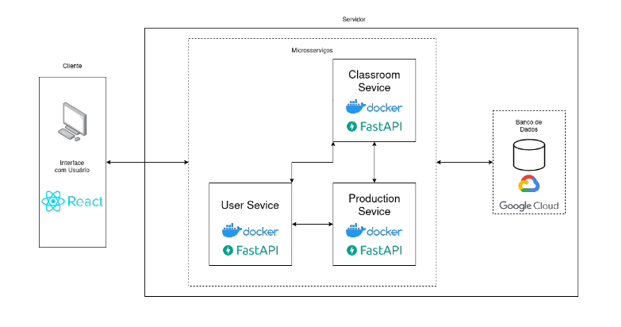
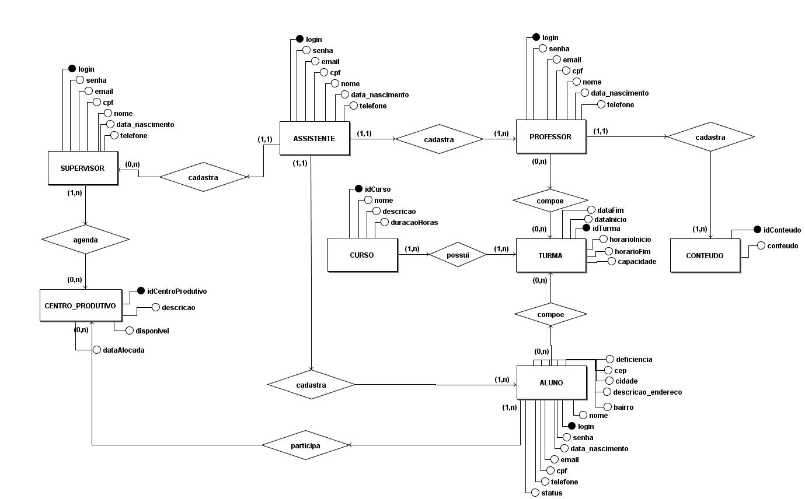

# Documento de Arquitetura de Software

## Visão Geral

Este documento descreve a arquitetura de software para um projeto que utiliza o React no frontend, quatro microsserviços implementados com FastAPI e um banco de dados hospedado no Google Cloud. A arquitetura foi projetada para ser escalável, resiliente e de alto desempenho. A arquitetura do sistema é baseada em uma abordagem de microsserviços, onde diferentes componentes são separados em serviços independentes e interagem através de interfaces bem definidas. A seguir, apresenta-se um esboço da arquitetura em alto nível:



## Componentes

### Frontend React

O frontend do aplicativo será desenvolvido usando o React, um framework JavaScript popular para construção de interfaces de usuário interativas. O React permite a criação de componentes reutilizáveis e oferece uma renderização eficiente do lado do cliente. O frontend se comunicará com os microsserviços por meio de APIs RESTful.

### Microsserviços

O sistema consistirá em quatro microsserviços independentes, cada um implementado usando o FastAPI, um framework de desenvolvimento rápido de APIs em Python. Cada microsserviço será responsável por uma parte específica da lógica de negócios e se comunicará com outros microsserviços e com o frontend por meio de APIs RESTful.

Os microsserviços serão projetados seguindo princípios de escalabilidade horizontal, permitindo que mais instâncias dos serviços sejam implantadas conforme necessário para lidar com aumentos de carga. Eles também serão projetados para serem independentes e desacoplados, o que permitirá que sejam desenvolvidos, implantados e dimensionados separadamente.

Como design pattern para a arquitetura de cada MS, foi escolhido o DDD com o SOLID. Essa arquitetura combina os princípios de Microservices, que envolve dividir um sistema em componentes independentes, com os conceitos de DDD e SOLID, que promovem a organização do código-fonte e a manutenção de um design flexível e robusto.

No DDD, o foco é colocado no domínio do negócio, onde os Microservices são projetados em torno de domínios específicos. Cada Microservice representa uma parte isolada do sistema, com sua própria lógica de negócio, banco de dados e interface de programação (API).

A aplicação dos princípios SOLID (Single Responsibility, Open-Closed, Liskov Substitution, Interface Segregation e Dependency Inversion) na arquitetura de Microservices com DDD busca garantir que cada componente seja coeso, encapsulado e dependa apenas de abstrações, em vez de implementações concretas. Isso promove a modularidade, reutilização de código e facilidade de manutenção.

Um exemplo da arquitetura em camadas para o MS Classroom seria:

```
src
   |-- domain
   |     |-- entities
   |     |       |-- Turma.js
   |     |       |-- Curso.js
   |     |
   |     |-- repositories
   |     |       |-- TurmaRepositoryBaseModel.js
   |     |       |-- CursoRepositoryBaseModel.js
   |
   |-- application
   |     |-- useCases
   |     |       |-- CadastrarTurmaUseCase.js
   |     |       |-- CadastrarCursoUseCase.js
   |     |       |-- CadastrarAlunoNaTurmaUseCase.js
   |     |
   |     |-- controllers
   |             |-- TurmaController.js
   |             |-- CursoController.js
   |
   |-- infrastructure
   |     |-- repositories 
   |     |       |-- TurmaRepository.js
   |     |       |-- CursoRepository.js
   |     |
   |     |-- external                 
   |             |-- ProfessorController.js  
   |             |-- AlunoController.js   

```

### Banco de Dados no Google Cloud

O banco de dados será hospedado no Google Cloud, aproveitando os serviços de banco de dados oferecidos pela plataforma. Por meio do uso do Google Cloud SQL para fornecer um banco de dados relacional altamente disponível e escalável.

O Google Cloud SQL oferece recursos como replicação, backups automáticos e escalabilidade vertical e horizontal. Os microsserviços se conectarão ao banco de dados por meio da biblioteca de acesso a dados SQLAlchemy.

#### DER
 De acordo com Nogueira (1988 apud FRANCK; PEREIRA; FILHO, 2021), um Diagrama de Entidade-Relacionamento (DER) é uma representação gráfica que ilustra as interações entre "entidades", as quais podem englobar indivíduos, elementos físicos ou abstratos, presentes em um sistema. Ao adotar o DER, é viável estruturar as informações de maneira nítida e exata, o que simplifica a compreensão do sistema e viabiliza a criação de um banco de dados eficaz e bem-organizado. Adicionalmente, o DER pode ser empregado como uma ferramenta de comunicação entre a equipe de desenvolvimento e os envolvidos no projeto, possibilitando que todos tenham uma percepção clara dos dados que serão manipulados pelo sistema.

<center>
<figure>



<figcaption style="text-align: center !important">
    Fonte: Próprio autor
  </figcaption>
</figure>
</center>

## Comunicação entre Componentes

A comunicação entre o frontend React e os microsserviços será feita por meio de APIs RESTful. Os microsserviços fornecerão endpoints bem definidos para receber solicitações e fornecer respostas em formato JSON. O frontend fará chamadas HTTP para os endpoints apropriados para obter e enviar dados.

Para a comunicação entre os microsserviços, serão enviadas mensagens assíncronas por meio de uma fila de mensagens, para garantir a escalabilidade e a resiliência do sistema. Ao lidar com operações assíncronas, os microsserviços podem publicar mensagens em uma fila e outros microsserviços podem consumir essas mensagens e executar as ações necessárias.

## Considerações de Segurança

- Implementação de autenticação e autorização nos microsserviços para controlar o acesso aos recursos protegidos.
- Uso de conexões seguras (HTTPS) para todas as comunicações entre componentes.
- Aplicação de práticas de codificação segura e validação adequada de entrada para evitar vulnerabilidades de segurança.
- Configuração adequada de permissões e restrições de acesso ao banco de dados no Google Cloud.


## Considerações de Escalabilidade

A arquitetura proposta permite escalabilidade horizontal dos microsserviços, o que significa que mais instâncias dos serviços podem ser adicionadas para lidar com aumentos de carga. No caso do banco de dados no Google Cloud, a escalabilidade vertical e horizontal é suportada pelo serviço de banco de dados escolhido, como o Google Cloud SQL. Recomenda-se explorar as opções fornecidas pela plataforma para dimensionar o banco de dados de acordo com as necessidades do sistema.

## Considerações de Tolerância a Falhas

A arquitetura proposta busca ser resiliente a falhas, permitindo que o sistema continue operando mesmo em caso de falha de um ou mais componentes.

- Implementação de mecanismos de recuperação automática para os microsserviços, como a reinicialização automática de contêineres em caso de falhas.
- Configuração de pontos de extremidade de monitoramento e sondagem para verificar a disponibilidade e o estado dos microsserviços.
- Utilização de estratégias de repetição de mensagens em caso de falha temporária na comunicação entre os componentes.

## Considerações de Manutenção

A manutenção do sistema é uma consideração importante para garantir a confiabilidade e a estabilidade a longo prazo. Algumas práticas recomendadas incluem:

- Implementação de testes automatizados para os microsserviços, incluindo testes de unidade, testes de integração e testes de aceitação.
- Estabelecimento de processos de implantação contínua para facilitar a implantação e a atualização dos microsserviços.
- Monitoramento regular do desempenho e da saúde do sistema para identificar problemas e realizar ajustes e otimizações conforme necessário.
- Realização de backups regulares do banco de dados no Google Cloud para garantir a disponibilidade e a recuperação em caso de falhas ou perda de dados.

## Nota

É importante lembrar que este é apenas um esboço e que detalhes adicionais podem ser necessários durante a implementação real do projeto. Para futuras mudanças recomenda-se a realização de análises mais aprofundadas e discussões com a equipe de desenvolvimento para refinar e ajustar a arquitetura de acordo com os requisitos específicos do projeto.


## Referências

NOGUEIRA, D. L. Ferramentas automatizadas para apoio ao projeto estruturado: uma aplicação do diagrama de entidade-relacionamento. Tese (Doutorado) — Universidade Federal do Rio de Janeiro, Rio de Janeiro, RS, 1988. Tese (Doutorado em Ciências em Engenharia de Sistemas e Computação). 

FRANCK, K. M.; PEREIRA, R. F.; FILHO, J. V. D. Diagrama entidade-relacionamento: uma ferramenta para modelagem de dados conceituais em engenharia de software. Research, Society and Development, v. 10, n. 8, 2021.

## Histórico de versão

|  Data  |   Versão   | Descrição |Autor(es)
|:------:|-----------:|:-------:|:---:|
| 25/05/2023 | 1.0 | Criando primeira versão | [Gustavo Afonso](https://github.com/GustavoAPS)|
| 28/05/2023 | 1.1 | Adicionando DER | [@biancasofia](https://github.com/biancasofia)|
| 29/05/2023 | 1.2 | Adicionando arquitetura dos MS | [@gpersijn](https://github.com/gpersijn)|
