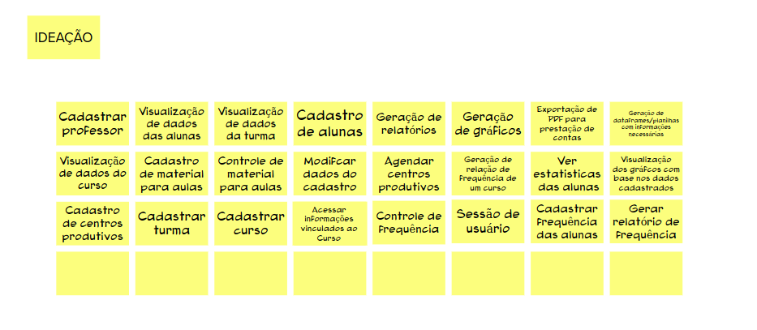

## Histórico de versão

|  Data  |   Versão   | Descrição |Autor(es)
|:------:|-----------:|:-------:|:---:|
| 02/05/2023 | 1.0 | Criação de documento e adição de conteúdo | [@caio-lelis](https://github.com/caio-lelis) e  [@marialuisa214](https://github.com/marialuisa214) 

## Introdução

 Brainstorming de funcionalidades é uma técnica usada para gerar ideias de novas funcionalidades ou recursos para um produto ou serviço. É um processo criativo e livre de julgamentos, que visa explorar todas as possibilidades para melhorar o produto ou serviço e torná-lo mais atraente e útil para os usuários. As ideias geradas são registradas em uma lista ou quadro para análise posterior.

