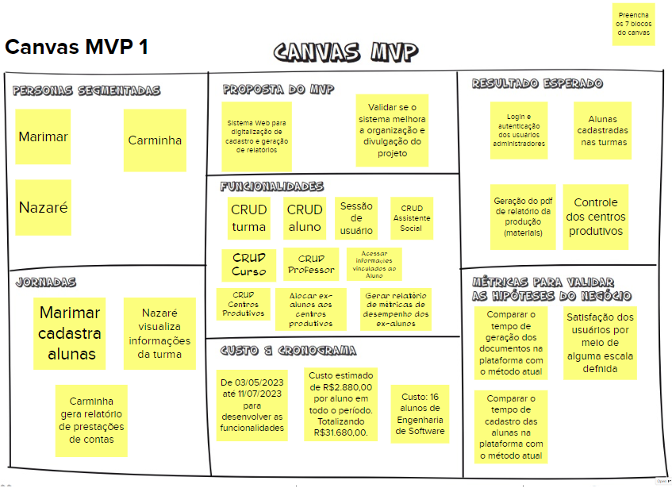

# Canvas MVP

## Histórico de versões

| Data       | Versão | Descrição                          | Autor(es)                                                                                                                                       |
| ---------- | ------ | ---------------------------------- | ----------------------------------------------------------------------------------------------------------------------------------------------- |
| 04/05/2023 | 1.0    | Criação do documento | [@Peh099](https://github.com/Peh099) e [@FilhoDoan](https://github.com/FilhoDoan) |
| 04/05/2023 | 1.1    | Criação da Introdução do Documento | [@Peh099](https://github.com/Peh099) e [@FilhoDoan](https://github.com/FilhoDoan) |
| 04/05/2023 | 1.2    | Adição da imagem | [@Peh099](https://github.com/Peh099) e e [@FilhoDoan](https://github.com/FilhoDoan) |

## 1. Introdução

 
 O Canvas MVP é uma ferramenta para validar ideias de produtos. É um quadro visual que auxilia empreendedores a alinhar e definir a estratégia do MVP–Minimum Viable Product, em inglês, a versão mais simples de um produto que pode ser disponibilizada para o negócio (produto mínimo) e que possa ser efetivamente utilizado e validado pelo usuário final (produto viável) [1].

 
O canvas possui sete blocos que descrevem: a visão do MVP, as hipóteses de negócios, suas métricas, as personas e suas jornadas, as funcionalidades, e o custo e cronograma para sua criação, onde cada bloco busca responder o seguinte:

1. Proposta do MVP – Qual é a proposta deste MVP?
2. Personas segmentadas – Para quem é esse MVP? Podemos segmentar e testar este MVP em um grupo menor?
3. Jornadas – Quais jornadas são atendidas ou melhoradas com este MVP?
4. Funcionalidades – O que vamos construir neste MVP? Que ações serão simplificadas ou melhoradas neste MVP?
5. Resultado esperado – Que aprendizado ou resultado estamos buscando neste MVP?
6. Métricas para validar as hipóteses do negócio – Como podemos medir os resultados deste MVP?
7. Custo & Cronograma – Qual é o custo e a data prevista para a entrega deste MVP? Depois de entregue, quanto tempo precisamos coletar os dados para decidir se pivotamos ou prosseguimos?

## 2. Canvas MVP

<figure>

<figcaption style="text-align: center !important">
    Fonte: Próprio autor
  </figcaption>
</figure>

## 3. Referencial teórico

[1] Lean Inception, “O Canvas MVP”. Disponivel em: https://caroli.org/o-canvas-mvp/