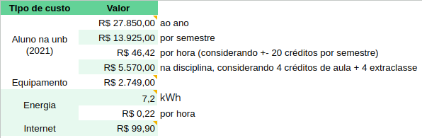

# Plano de gerenciamento de custos

## 1. Introdução

 
  Este documento terá relevância para a estimativa, planejamento e monitoramento do custo global do projeto AMIS, englobando, por exemplo, o valor associado a cada estudante participante no desenvolvimento do projeto. O gerenciamento de custos também envolve o estabelecimento de um plano de orçamento adequado, que define os recursos financeiros disponíveis e como eles serão alocados ao longo do projeto. 

## 2. Cálculo de gastos

### Mão de Obra e Tecnologias

 
Segundo o Jornal Unesp (2022), o custo de cada aluno por ano soma R$ 27.850,00, ou seja, R$ 13.925,00 por semestre. Nesse sentido, pode-se considerar que cada hora do aluno custa R$ 46,42. Assim, o custo na disciplina é de R$ 5.570,00, considerando 4 créditos em aulas e 4 créditos em atividades extraclasse, sendo que cada hora corresponde à 2 créditos. 

 
Segundo o site Dev Por Aí (2023), o notebook Lenovo Ideapad 3 é uma excelente opção para programar, uma vez que possui o hardware adequado para essa finalidade. Dessa forma, esse modelo foi utilizado como referência de custo de equipamento, estando disponível por R$ 2.749,00 a versão com linux na Amazon em 2023. Ao todo, serão necessários 16 equipamentos para a equipe, totalizando R$ 43.984,00.

 
Com base nas informações fornecidas pelo Mercado Livre de Energia (2023), o custo estimado de energia por hora é de R$ 0,22, totalizando R$ 25,82 por aluno ao final. De acordo com o site Melhor Escolha (2023), existem várias abordagens para avaliar a qualidade da internet banda larga, sendo uma delas a análise dos dados anuais provenientes da pesquisa de satisfação conduzida pela Agência Nacional de Telecomunicações (Anatel). Nesse sentido, é relevante considerar o custo da internet popular, como o pacote oferecido pela Claro, que tem o valor de R$ 99,90. Assim, para atender à demanda de conectividade da equipe, serão adquiridos planos individuais mensais de internet, uma vez que todos os membros da equipe estarão trabalhando remotamente. A seguir, apresenta-se um esboço desses custos:
 

<figure>

<figcaption style="text-align: center !important">
    Fonte: Próprio autor
  </figcaption>
</figure>

 Nesse sentido, o custo por aluno e total pode ser observado na figura abaixo, em que o custo é multiplicado pelos 16 alunos.

<figure>

<figcaption style="text-align: center !important">
    Fonte: Próprio autor
  </figcaption>
</figure>

### Custos por Sprint

 Dessa forma, o custo total estimado do projeto por sprint é observado a seguir:

<iframe width="100%" height="300" src="https://docs.google.com/spreadsheets/d/e/2PACX-1vR3xu2orrDOewAh7eKZkleKCsspbnWjFos599n8yiOOb0V8EAKSUtyouqgRxCgEWcZGBo7r8XPD_73k/pubhtml?gid=572171327&amp;single=true&amp;widget=true&amp;headers=false"></iframe>

## 3. Referencial teórico

VIVENDO BAURU. Quanto custa um aluno para a UnB? Disponível em: https://www.vivendobauru.com.br/quanto-custa-um-aluno-para-a-unb/. Acesso em: 16/05/2023.

MELHOR ESCOLHA. Melhor Internet Banda Larga do Brasil em 2022 segundo a Anatel. Disponível em: https://melhorescolha.com/blog/melhor-internet-banda-larga-brasil/. Acesso em: 16/05/2023.

JORNAL UNESP. Cobrança de mensalidade não é a solução para o financiamento da universidade pública. Disponível em: https://jornal.unesp.br/2022/06/08/cobranca-de-mensalidade-nao-e-a-solucao-para-o-financiamento-da-universidade-publica/#:~:text=O%20custo%20por%20aluno%20dos,ao%20custo%20em%20institui%C3%A7%C3%B5es%20privadas.%E2%80%9D. Acesso em: 16/05/2023

DEV POR AÍ. 5 Melhores notebooks para programar em 2023. Disponível em: https://devporai.com.br/5-melhores-notebooks-para-programar/. Acesso em: 16/05/2023.

MERCADO LIVRE DE ENERGIA. Bandeiras tarifárias 2022/2023 são definidas pela Aneel. Disponível em: https://www.mercadolivredeenergia.com.br/noticias/bandeiras-tarifarias-2022-2023-sao-definidas-pela-aneel/. Acesso em: 16/05/2023.

## Histórico de versões

| Data       | Versão | Descrição                          | Autor(es)                                                                                                                                       |
| ---------- | ------ | ---------------------------------- | ----------------------------------------------------------------------------------------------------------------------------------------------- |
| 16/05/2023 | 1.0    | Criação do documento e cálculos de custo  | [@biancasofia](https://github.com/biancasofia), [@lorraynecardozo](https://github.com/lorraynecardozo) |

