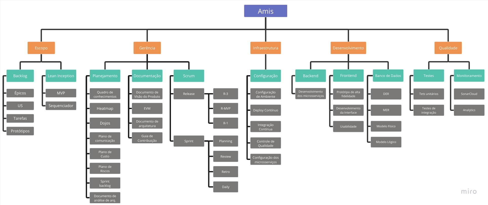

## EAP

## 1. Introdução

O documento de Estrutura Analítica de Projeto (EAP), também conhecido como Work Breakdown Structure (WBS), é uma ferramenta de gerenciamento de projetos que divide o trabalho do projeto em partes menores e mais gerenciáveis.

A EAP é uma representação hierárquica do escopo do projeto, organizada em níveis, onde o nível mais alto representa o objetivo geral do projeto e os níveis inferiores descrevem os elementos ou tarefas que devem ser realizados para atingir esse objetivo.

A estrutura analítica de projeto é frequentemente usada para auxiliar na definição do escopo do projeto, na alocação de recursos, na programação e no controle de custos. Além disso, a EAP também pode ajudar a identificar as interdependências entre as tarefas e a fornecer uma visão geral do projeto que pode ser facilmente comunicada a todas as partes interessadas.

## 2. EAP Amis

## Histórico de versão

|    Data    | Versão |         Descrição          |                    Autor(es)                    |
| :--------: | -----: | :------------------------: | :---------------------------------------------: |
| 10/05/2023 |    1.0 | Criação da Primeira Versão | [Gustavo Afonso](https://github.com/GustavoAps) |
| 15/05/2023 |    2.0 |    Criação do novo EAP     | [Gustave Persijn](https://github.com/gpersijn)  |
