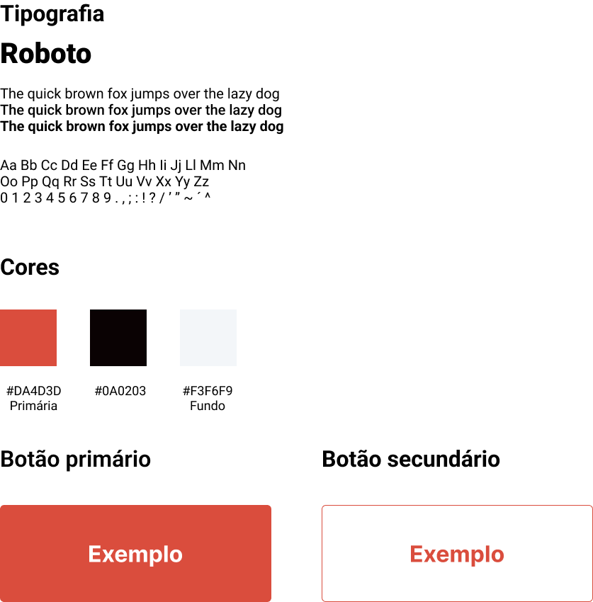

# Guia de estilo

## 1. Introdução

A guia de estilo é um documento que tem finalidade de apresentar de forma clara e objetiva as diretrizes gerais de desgin do projeto, como fontes, cores e outros elementos.

## 2. Elementos

## Histórico de versões

| Data       | Versão | Descrição            | Autor(es)                                           |
| ---------- | ------ | ---------------------| --------------------------------------------------- |
| 22/04/2023 | 1.0    | Criação do documento |[Gustavo Afonso](https://github.com/GustavoAps)      |