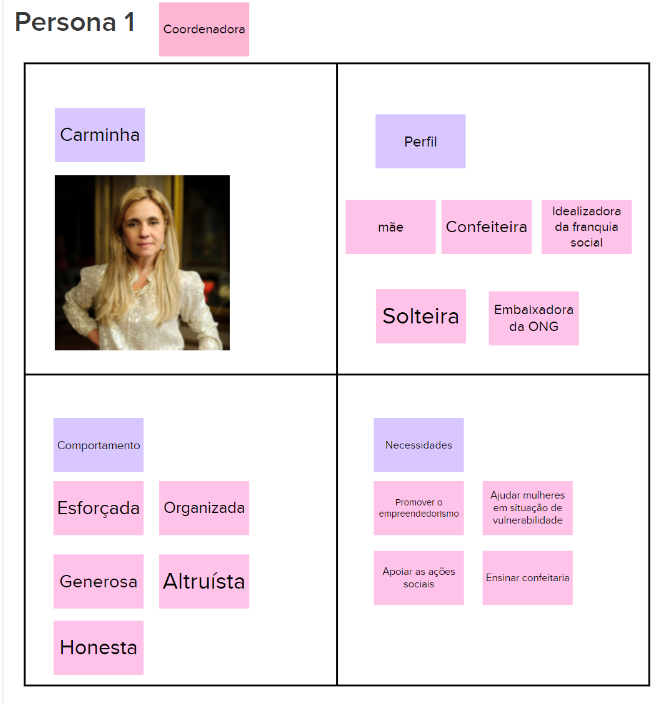
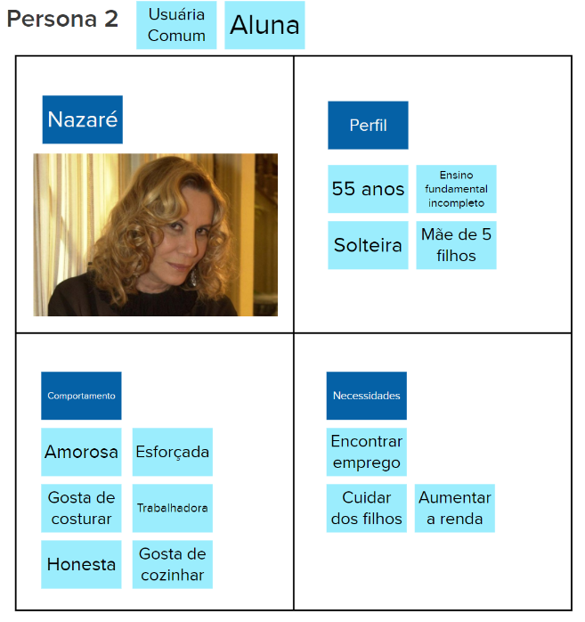
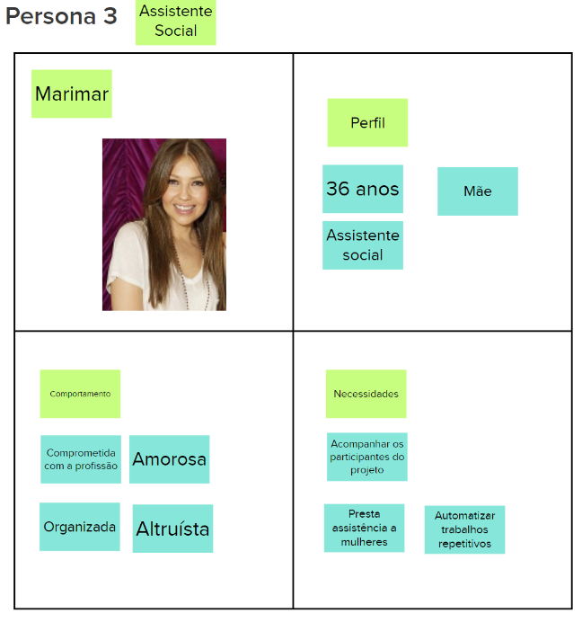

# Personas

## Introdução

 Personas são representações fictícias dos usuários. São baseadas em dados reais sobre o comportamento dos mesmos. Também inclui criar suas próprias histórias pessoais, motivações, objetivos, desafios e interesses. No contexto de software, as personas são utilizadas para identificar as necessidades dos usuários e auxiliar na definição das funcionalidades do sistema. Ao trazer as perspectivas de cada persona, a equipe pode descrever as funcionalidades do produto final sob a visão de quem vai interagir com ele, colaborando com uma melhor experiência do usuário.
 

 Foram criadas 3 personas para este produto. As personas representam a coordenadora, a aluna que pode aproveitar qualquer curso disponível da ONG e a assistente social, conforme mostram as imagens a seguir. 

### **Persona 1:** 
 Carminha

**Representa:** 
 Coordenadora

<figure>

  <figcaption style="text-align: center !important">
    Fonte: Próprio autor
  </figcaption>
</figure>

### **Persona 2:** 
 Nazaré

**Representa:** 
 Usuária comum, aluna

<figure>

  <figcaption style="text-align: center !important">
    Fonte: Próprio autor
  </figcaption>
</figure>

### **Persona 3:**  
 Marimar 

**Representa:** Assistente social
<figure>

  <figcaption style="text-align: center !important">
    Fonte: Próprio autor
  </figcaption>
</figure>

## Referencial teórico

SIQUEIRA, André. Persona: o que é, como definir e por que criar uma para sua empresa [+ exemplos práticos e um gerador]. Resultados Digitais, 2021. Disponível em: https://resultadosdigitais.com.br/marketing/persona-o-que-e/. Acesso em: 20 abr. 2023.

## Histórico de versões

| Data       | Versão | Descrição                                              | Autor(es)                                           |
| ---------- | ------ | ------------------------------------------------------ | --------------------------------------------------- |
| 20/04/2023 | 1.0    | Criação de documento e adição de conteúdo |[@biancasofia](https://github.com/biancasofia), [@CauaMatheus](https://github.com/CauaMatheus) e [@caio-lelis](https://github.com/caio-lelis)|

