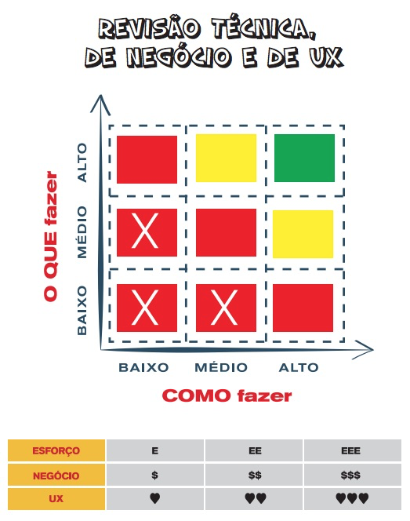
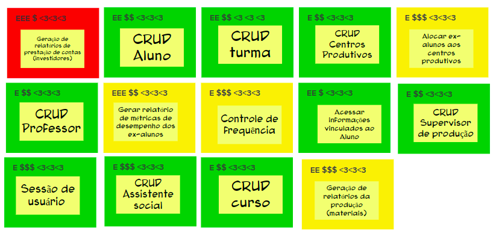
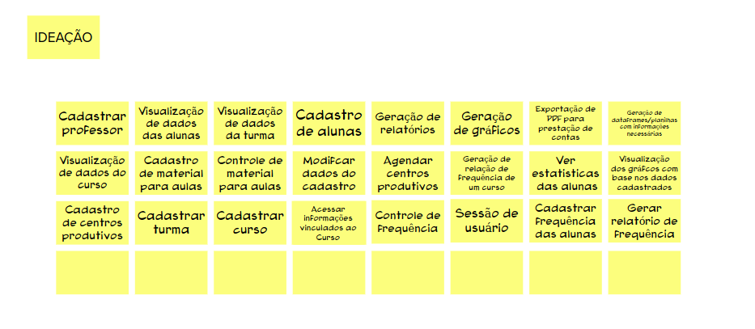

## Introdução

 A revisão técnica, de negócio e de UX são atividades que buscam validar e melhorar as soluções propostas para um problema ou oportunidade de negócio. A revisão técnica analisa a viabilidade técnica, a revisão de negócio avalia a viabilidade financeira e estratégica e a revisão de UX foca na experiência do usuário. Juntas, essas revisões validam as soluções propostas, melhoram o entendimento dos envolvidos e identificam possíveis pontos de melhoria.

<strong>A cor e a marcação vão ajudar a equipe nas atividades subsequentes para priorizar, estimar e planejar.
</strong>

  

### Exemplo:

  

<!--  -->

## Histórico de versão

|  Data  |   Versão   | Descrição |Autor(es)
|:------:|-----------:|:-------:|:---:|
| 02/05/2023 | 1.0 | Criação de documento e adição de conteúdo | [@CauaMatheus](https://github.com/CauaMatheus) e  [@FHansen98](https://github.com/FHansen98) 
