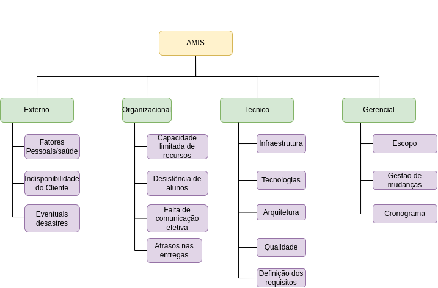

# Plano de gerenciamento de riscos

## 1. Introdução

O propósito deste documento é realizar a identificação das principais categorias de risco no projeto, compreender suas consequências e propor medidas adequadas para minimizar sua ocorrência ao máximo, minimizando a probabilidade de impactos negativos, visando aprimorar as chances de sucesso do projeto.
 

## 2. Estrutura Analítica de Riscos (EAR)

A Estrutura de Análise de Riscos é uma representação em forma hierárquica dos riscos, organizados de acordo com suas subcategorias, sendo elas o risco externo, organizacional, técnico e gerencial.
 

<figure>

<figcaption style="text-align: center !important">
    Fonte: Próprio autor
  </figcaption>
</figure>

## 3. Descrição dos Riscos da Estrutura Analítica de Riscos

Nesta descrição, o impacto também é classificado. O risco muito baixo denota um impacto que tem pouquíssima importância no projeto, o baixo indica um impacto que pode afetar uma iteração do projeto. Já o médio representa um impacto que afeta mais de uma iteração do projeto. O alto é um risco pelo qual o impacto atrasa o projeto como um todo. O muito alto representa um impacto que inviabiliza o projeto.  

### Riscos Externos

| Id | Risco | Consequência | Contigência | Impacto |
|------|--------|-----------|-----------|----------------|
|   R01  |  Fatores Pessoais/Saúde  | Atraso nas entregas, ausência em reuniões e, como resultado, falta de atualização sobre o progresso do projeto.  |  Manter toda a equipe informada sobre as atividades em andamento de cada subequipe. Reorganizar em casos extremos.| Alto |
|   R02  |  Indisponibilidade do Cliente  |  Enfrentar desafios ao avançar com a elaboração dos documentos do projeto e a possibilidade de retrabalho em documentos criados sem validação.  |  Adequar as datas das reuniões conforme a disponibilidade do cliente.  | Alto| 
|   R03  |  Eventuais desastres  |  Interrupção das atividades do projeto. |  -  | Muito Alto |

### Riscos Organizacionais

| Id | Risco | Consequência | Contigência | Impacto |
|------|--------|-----------|-----------| ---------| 
|   R04  |  Capacidade limitada de recursos  | Impactar negativamente a execução do projeto e resultar em atrasos, baixa qualidade ou dificuldades na entrega. |  Analisar os recursos necessários desde o início e otimizar o existênte.|  Médio  |
|   R05  |  Desistência de alunos  |  Diminuição do volume de entregas e sobrecarga dos membros da equipe. |  Manter os membros engajados.  | Médio |
|   R06  |  Falta de comunicação efetiva..  |  Atrasos na conclusão das entregas, maior probabilidade de desentendimento e retrabalho. |  Manter a comunicação entre os membros da equipe.  | Alto |
|   R07 |  Atrasos nas entregas  |  Resulta em insatisfação do cliente em não receber as funcinalidades propostas. |  Realizar reuniões para informar o andamento das atividades, fazer bom planejamento e documentar as decisões.  | Alto |

### Riscos Técnicos

| Id | Risco | Consequência | Contigência | Impacto |
|------|--------|-----------|-----------| ---------|
|   R08  |  Infraestrutura  |  Problemas na configuração do ambiente de desenvolvimento . |  Realizar treinamentos sobre infraestrutura. | Alto |
|   R09  |  Tecnologias  |  Dificuldade no desenvolvimento das ativiades do projeto.  |  Realizar treinamento das tecnologias.   | Médio |
|   R10  |  Arquitetura  |  Dificuldade de manutenção do projeto, de integração de novas funcionalidades, baixa escalabilidade. |  Realizar pesquisa e análise para melhor arquitetura. |Médio |
|   R11  |  Qualidade |  Resulta na falta de confiabilidade, funcionalidades comprometidas e insatisfação do cliente. |  Realizar planejamento e projeção cuidadosamente, e adoção de boas práticas de desenvolvimento.  | Médio |
|   R12  |  Definição de requisitos  |  Resulta na construção de um software que não atende as necessidades do cliente. |  Realizar a definição de requisitos completo. | Alto |

### Riscos de Gerenciamento

| Id | Risco | Consequência | Contigência | Impacto |
|------|--------|-----------|-----------| --------- |
|   R13  |  Escopo  |  Escopo mal gerenciado pode levar a atrasos no cronograma do projeto.  | Definir bem o escopo do projeto juntamente ao cliente e fazer priorização das atividades. | Alto | 
|   R14  |  Gestão de Mudanças  |  Isso pode levar a uma necessidade de retrabalho não previsto, potencialmente resultando em atrasos nas entregas.  |  Definir bem o escopo do projeto juntamente ao cliente e avaliar o impacto da mudança. | Médio  |
|   R15  |  Cronograma  |  Erros na definição dos prazos têm um impacto direto nas entregas do projeto. |  Realizar uma estimativa colaborativa com toda a equipe para determinar o tempo e esforço necessários para concluir cada atividade. Também alocar membros para tentar finalizar a tarefa   |  Médio |

## Histórico de versões

| Data       | Versão | Descrição                          | Autor(es)                                                                                                                                       |
| ---------- | ------ | ---------------------------------- | ----------------------------------------------------------------------------------------------------------------------------------------------- |
| 18/05/2023 | 1.0    | Criação do documento e adição de conteúdo | [@biancasofia](https://github.com/biancasofia), [@lorranyoliveira](https://github.com/lorranyoliveira) |