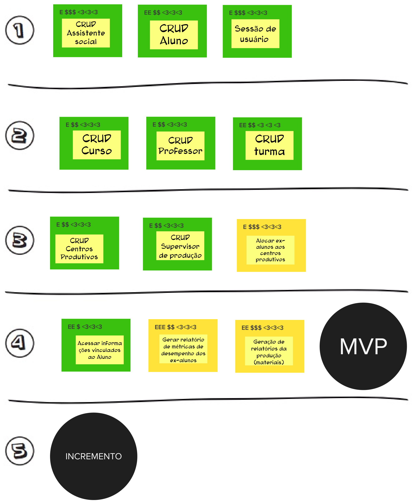

# Sequenciador

## 1. Introdução

 
O sequenciador é uma ferramenta visual, de fácil entendimento e bastante eficaz para que as pessoas compreendam, organizem e priorizem melhor os seus itens de trabalho. As cores de fundo indicam o quão confiante os membros estão em relação a atividade, os marcadores <b>E</b>, <b>$</b> e <b> <3 </b> uma relação de esforço, gasto financeiro e o retorno ao usuário que atividade produzirá quando concluída. Por fim cada item é dividido em ondas que contém até 3 <i> tasks </i> a ordem em que as atividades serão realizadas.

## 2. Sequenciador

Visto a definição de um sequenciador, e a fim de organizar e controlar a ordem de execução das atividades no processo de desenvolvimento, garantir que a realização do projeto aconteça na sequência correta e as entregas sejam feitas de forma adequada, minimizando possíveis atrasos e conflitos, o sequenciador está definido da seguinte forma (sendo os tópicos descritos a seguir a sequência de realização das atividades).

<figure>

<figcaption style="text-align: center !important">
    Fonte: Próprio autor
  </figcaption>
</figure>

## 3. Referencial teórico

[1] Lean Inception, [Sequenciador] como ordenar e priorizar em: [https://caroli.org/sequenciador/](https://caroli.org/sequenciador/)

## Histórico de versões

| Data       | Versão | Descrição         | Autor(es)                                                                       |
| ---------- | ------ | ----------------- | ------------------------------------------------------------------------------- |
| 13/05/2023 | 1.0    | Criação da página | [@iagorrr](https://github.com/iagorrr), [gaubiela](https://github.com/gaubiela) |
