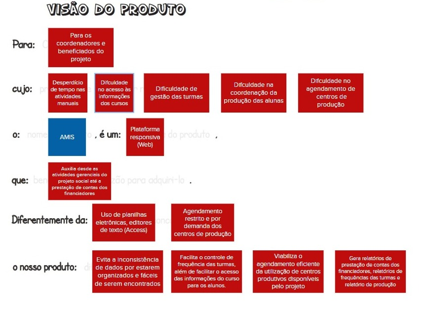

## Histórico de versão

|  Data  |   Versão   | Descrição |Autor(es)
|:------:|-----------:|:-------:|:---:|
| 26/04/2023 | 1.0 | Criação de documento e adição de conteúdo | [@FHansen98](https://github.com/FHansen98), [@Peh099](https://github.com/Peh099) e [@caioalvesbraga](https://github.com/caioalvesbraga) |

## Introdução

 Um produto que está em processo de desenvolvimento, seja um site, máquina, serviço ou simplesmente um objeto não começa a ser desenvolvido/fabricado do zero. Antes de se chegar a essa etapa, é necessário ter definido algumas ideias a respeito de onde almeja chegar, por isso, se faz necessário obter uma visão do produto detalhada, a fim de ajudar a traçar os passos iniciais do projeto.

Uma visão de produto bem elaborada e definida ajuda na compreensão clara e abrangente do objetivo, valor e propósito do produto ou serviço que uma empresa oferece aos seus clientes. Ela define de forma clara o público-alvo, identifica as dores/necessidades dos usuários que o produto visa atender, bem como estabelece os recursos e funcionalidades necessários para atender a essas necessidades. A visão de produto garante um desenvolvimento estruturado e orientado, além de ajudar a empresa a definir sua estratégia de negócios e a alcançar seus objetivos de longo prazo.

